# Animal Crossing TTS for Streamers

Here's gonna explain how to use this app.

This is the main app's window. Here you can connect to different stream services and also test the pitch of your TTS.

To change the pitch, you just need to move the slider, then click "Test Voice" to hear how it will sound.

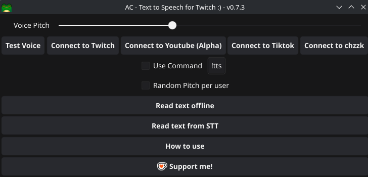

## Disclaimer

This application is totally FREE and Open Source, there is no monetization in any shape or form and never will be, you are free to use, transform, or do anything with this code as long as you follow the GPLv3 license

If you want to support me, you can do it by sending me a Ko-fi

[](https://ko-fi.com/harpuia)

## Connect to Twitch

When you click "Connect to Twitch", a new windows with few options will appears

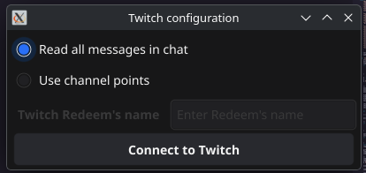

- Read all messages in chat will do exactly that. The TTS will make sounds with everyone chat message

- Use channel points will read the message writen in a given custom Redeem **You must put the exact name, caps and everything**

When you finnaly click "Connecto to Twitch" again, the following window will appears in your browser, asking you to give permission to read and write messages in your chat (At the moment, this app don't send any message to chat, it may change in the future if there is a interested feature to implement, or it will be removed in the future)

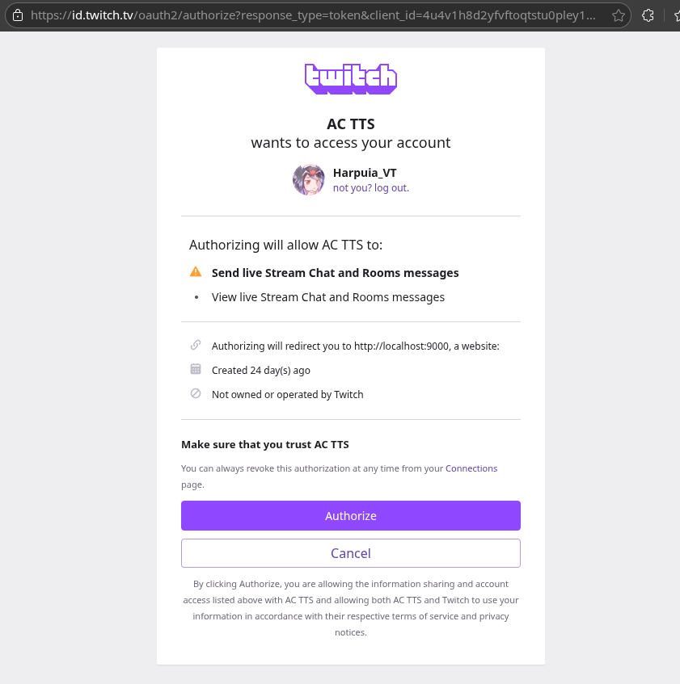

After you authorize the app, a new tab pointing to http://localhost:9000 should open and close by itself, if it doesn't close by itself, you can close it without issue. This is done because the way Twitch send it's authorization token can't be catch in any other way other than having a little frontend webapp to read the url and send it from there to the TTS backend, this is all being done locally.

If everything went right, the "Connect to Twitch" button should appears like this

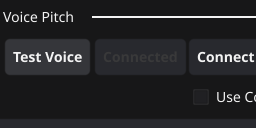

## Connect to Tiktok

When you click the "Connect to Tiktok" button, the following window will appears

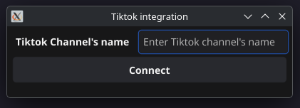

To connect to your Tiktok live chat, first you need to be already livestreaming and then, insert your Tiktok username in the field shown there. It may launch and error and ask you to try again, so you may have to try few times, but if Tiktok's window closes without showing any error, then it is connected.

## Connect to Youtube

You just need to enter the URL of your Youtube's stream (You must be already streaming)

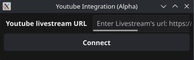

## Read text offline

This let you read any text you put in the text area without the need to connect to any platform.

Also, you can save the audio clips as wav files, first you need to enter a filename, and then select a folder in which the file will be saved

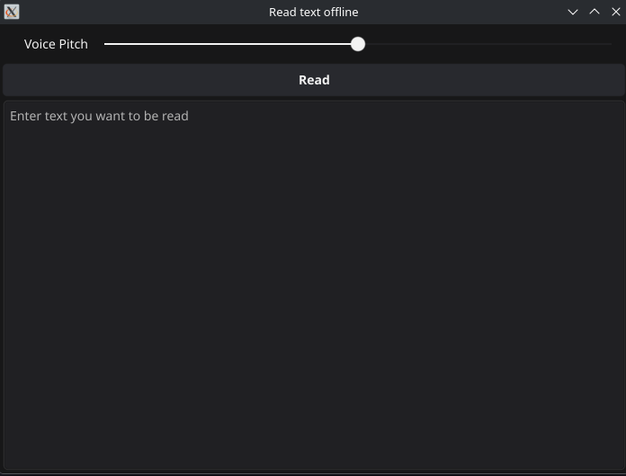

## Read from TTS

This option exists if you want to use this TTS alongside a STT tool (Speech-to-text). This will work with any STT tool that output a plain txt file or a standard .str file

First, you need to select file in which the STT tool will output the text, and then click "Read STT file" Button.

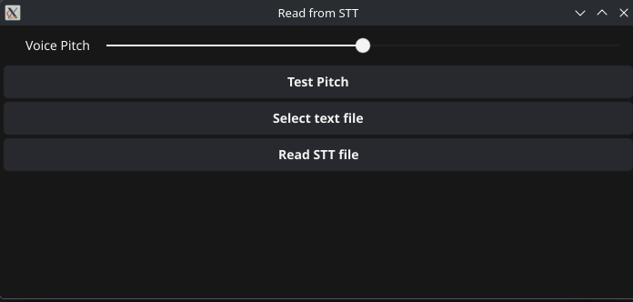

This option was developed and tested using [Closed Captioning OBS Plugin](https://github.com/ratwithacompiler/OBS-captions-plugin)


As long as you have **Write instantly** option selected and the file format is **Text only** or **SubRip subtitle .str**

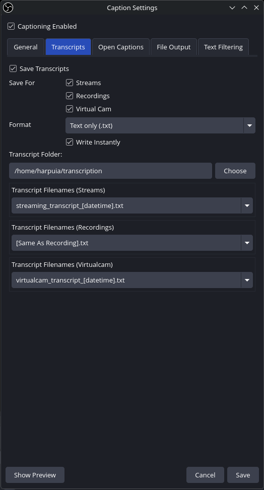

## Connect to chzzk

To connect the TTS to a chzzk livestream, you must be streaming first, and then inser the livestream id.

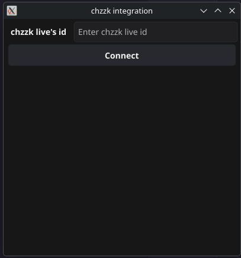

To obtain your livestream id, check the url of your livestream, the last part is your id

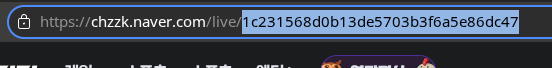

## Random pitch per user

As the name says, each user get a random Pitch and it stays the same until the TTS is restarted

## Whitelist

If you activate the Whitelist option, only the users in the input field will be able to trigger the TTS (It is also compatible alongsig the command function).

The users should be separated by a , example:

```
user_1,user_2,user_3
```
Lastly, click the Update whitelist button to make the Whitelist effective.

**You should update the whitelist everytime you add/remove a user**